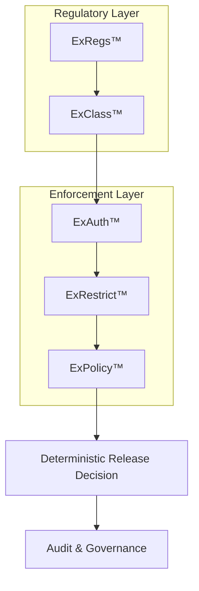

## The Architecture

AIEM is powered by the Export Control Graph Stack™.

```mermaid
flowchart TD

    subgraph Regulatory Layer
        A[ExRegs™] --> B[ExClass™]
    end

    subgraph Enforcement Layer
        B --> C[ExAuth™]
        C --> D[ExRestrict™]
        D --> E[ExPolicy™]
    end

    E --> F[Deterministic Release Decision]
    F --> G[Audit & Governance]
```

Export decisions become computed outcomes, not human interpretation.
